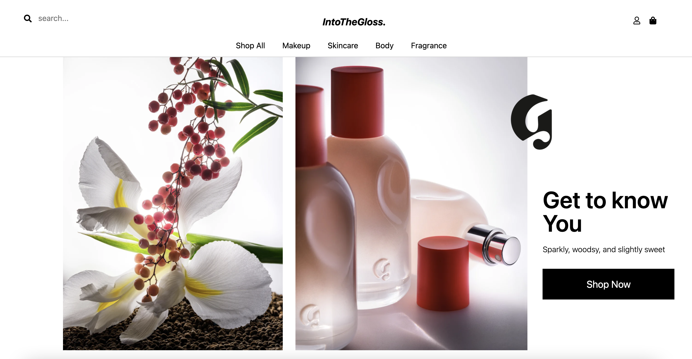

# README

## IntoTheGloss

IntoTheGloss is a beauty and skincare e-commerce site inspired by Glossier. 

Live site: [IntoTheGloss](https://isabelle-glossier.herokuapp.com/#/)



## Technologies Used 
* Ruby on Rails
* Postgres SQL 
* Javascript
* React 
* Redux
* LocalStorage

## Functionality 

### Splash Page 
 * Users are able to view featured items on main page.
 
 

### Sign In/Sign Up
 * Users are able to sign in to an existing acctount, create a new account, or use demo user log in feature all within the modal.
 


### Product Index 
 * Displays all products available 
 * Users are able to filter by category 
 * Users are able to cart to bag directly from index
 * Filters products by grabbing category from the URL params and passing information to product index controller logic
```
    def index 
        if params[:name] === 'shopall'
            @products = Product.all
            render "api/products/index"
        elsif params[:name] === "/"
            @products = Product.where(:title => ["Futuredew", "Boy Brow", "Cloud Paint", "Hand Cream", "Generation G", "Milk Jelly Cleanser", "Solution"])
            render "api/products/index"  
        else 
            @products = Product.joins(:category).where(categories: { name: params[:name]} )
            render "api/products/index"
        end
    end
```
 
 

### Product Show
 * Displays the product information 
 * If applicable, users are able to select a shade 
 
 

### Shopping Bag
 * Users can add, and remove cart items 
 * Utilizes localstorage 
 
 

### Search Bar
 * Users can search for products and if there is no match, they are given popular search terms to try 
 * Utlizes custom search logic in products controller 

Product Controller: 
```
    def search 
        @products = Product.where("title LIKE ?", "%#{params[:search_term]}%")
        render "api/products/index"
    end
```

Header Component Logic To Sanitze Search: 
```
    handleSubmit(e){
        if (e.key === 'Enter') {
            e.preventDefault();
            let searchTerm = this.state.search;
            let search = searchTerm.split(' ').map(word => this.capitalize(word)).join(' ')
            this.props.fetchSearch(search)
            this.props.history.push('/search')
            this.setState({ search: "" })
        }
    }
```
 
