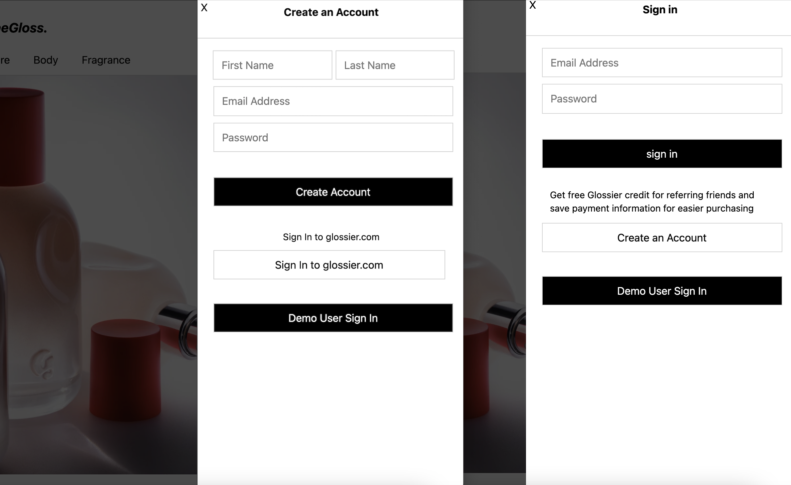

# README

## IntoTheGloss

IntoTheGloss is a beauty and skincare e-commerce site inspired by Glossier. 

Live site: [IntoTheGloss](https://isabelle-glossier.herokuapp.com/#/)

## Technologies Used 
* Ruby on Rails
* Postgres SQL 
* Javascript
* React 
* Redux
* LocalStorage

## Functionality 

### Splash Page 
 * Users are able to view featured items on main page.
 
 

### Sign In/Sign Up
 * Users are able to sign in to an existing acctount, create a new account, or use demo user log in feature all within the modal.
 

### Product Index 
 * Displays all products available 
 * Users are able to filter by category 
 * Users are able to cart to bag directly from index
 
 

### Product Show
 * Displays the product information 
 * If applicable, users are able to select a shade 
 
 

### Shopping Bag
 * Users can add, and remove cart items 
 * Utilizes localstorage 
 
 

### Search Bar
 * Users can search for products and if there is no match, they are given popular search terms to try 
 
 
